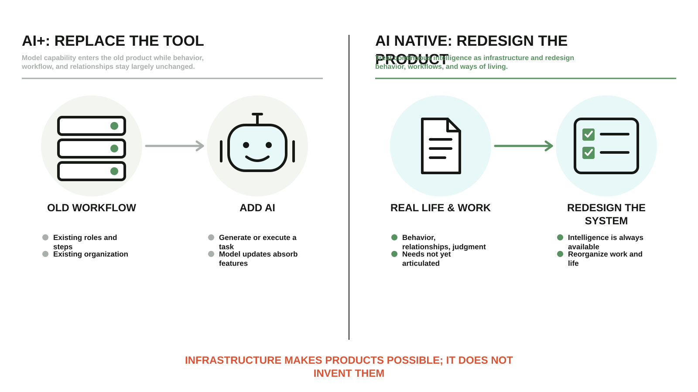
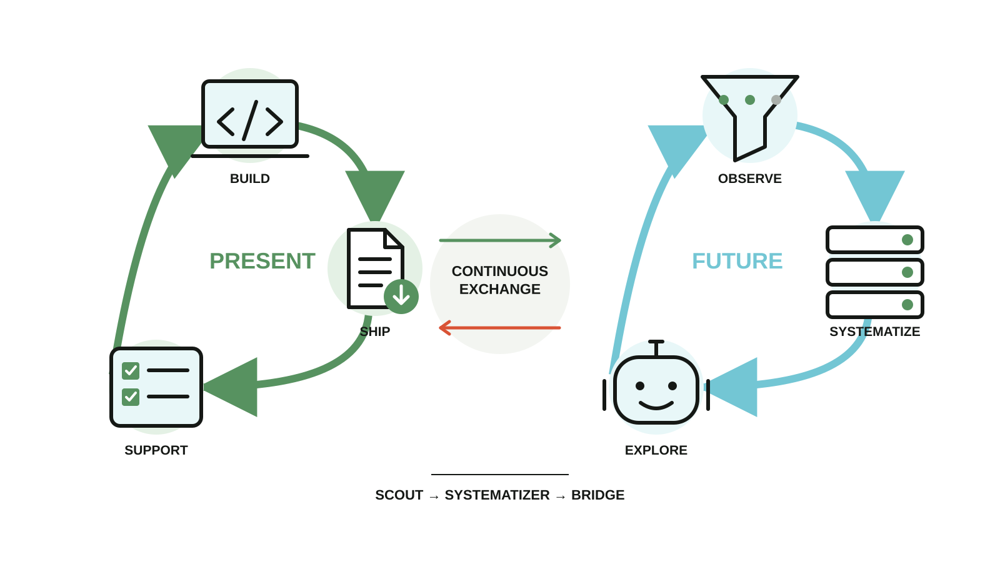

# Mechanism Illustration Skill

A Codex Skill and dependency-free SVG renderer for turning documented workflows into consistent bilingual mechanism illustrations.

## What it does

- extracts a small mechanism contract before drawing;
- separates the reusable art layer from Chinese and English text layers;
- renders deterministic `art.svg`, `zh.svg`, and `en.svg` files from JSON;
- includes Pipeline, Filter, Loop, Before/After, and Dual Loop grammars instead of forcing every mechanism into one row of steps;
- includes a second Editorial Field Map visual family for essays and conceptual writing;
- keeps generated explainers separate from product evidence;
- supports ImageGen-based pictogram exploration when a custom art layer is needed.

## Quick start

```bash
npm test
npm run render:examples
node scripts/render.mjs templates/telegram-miniapp.json dist
```

The renderer uses only Node.js built-ins. Copy a template, replace the documented stages and labels, then render both languages.

Use `layout: "pipeline"` for ordered stages. Use `layout: "filter"` when many possible inputs become a smaller relevant set. Use `layout: "loop"` when a response changes the next cycle. Use `before-after` when the structural difference is the argument, and `dual-loop` when two cycles operate on different time horizons.

## Layout catalog

### Pipeline — ordered stages

Use when stages have a meaningful order and a terminal output.


[Template JSON](templates/mechanism-illustration.json) · [Chinese SVG](examples/mechanism-illustration.zh.svg) · [English SVG](examples/mechanism-illustration.en.svg) · [Art layer](examples/mechanism-illustration.art.svg)

### Filter — many inputs become a relevant set

Use when selection is the mechanism, not merely another step.


[Template JSON](templates/cairn-context.json) · [Chinese SVG](examples/cairn-filter.zh.svg) · [English SVG](examples/cairn-filter.en.svg) · [Art layer](examples/cairn-filter.art.svg)

### Loop — feedback changes the next cycle

Use when the last state or a human response changes what happens next.


[Template JSON](templates/agent-feedback-loop.json) · [Chinese SVG](examples/agent-feedback-loop.zh.svg) · [English SVG](examples/agent-feedback-loop.en.svg) · [Art layer](examples/agent-feedback-loop.art.svg)

### Before/After — compare two causal structures

Use when the structural difference itself is the argument. This example uses the Editorial Field Map visual family.



[Template JSON](templates/ai-applications-before-after.json) · [Chinese SVG](examples/ai-applications-before-after.zh.svg) · [English SVG](examples/ai-applications-before-after.en.svg) · [Art layer](examples/ai-applications-before-after.art.svg)

### Dual Loop — two cycles exchange signals

Use when two loops operate on different time horizons and both must keep moving. This example also uses Editorial Field Map.



[Template JSON](templates/two-flywheels.json) · [Chinese SVG](examples/two-flywheels.zh.svg) · [English SVG](examples/two-flywheels.en.svg) · [Art layer](examples/two-flywheels.art.svg)

The more operational Telegram deployment Pipeline remains available in [English](examples/telegram-miniapp.en.svg) and [Chinese](examples/telegram-miniapp.zh.svg).

## Use as a Codex Skill

Install or link this directory as `mechanism-illustration` in your Codex skills folder, then invoke `$mechanism-illustration`. Repository owners can also vendor the directory and route matching tasks to `SKILL.md` from their `AGENTS.md`.

See [README.zh-CN.md](README.zh-CN.md) for Chinese documentation.
