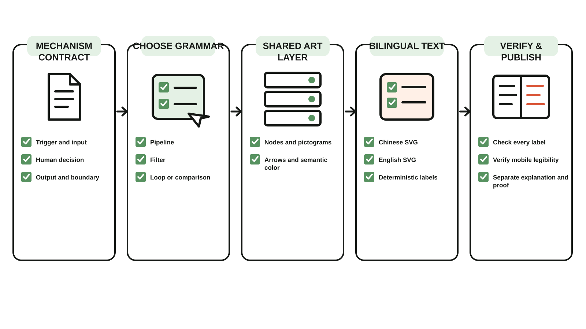
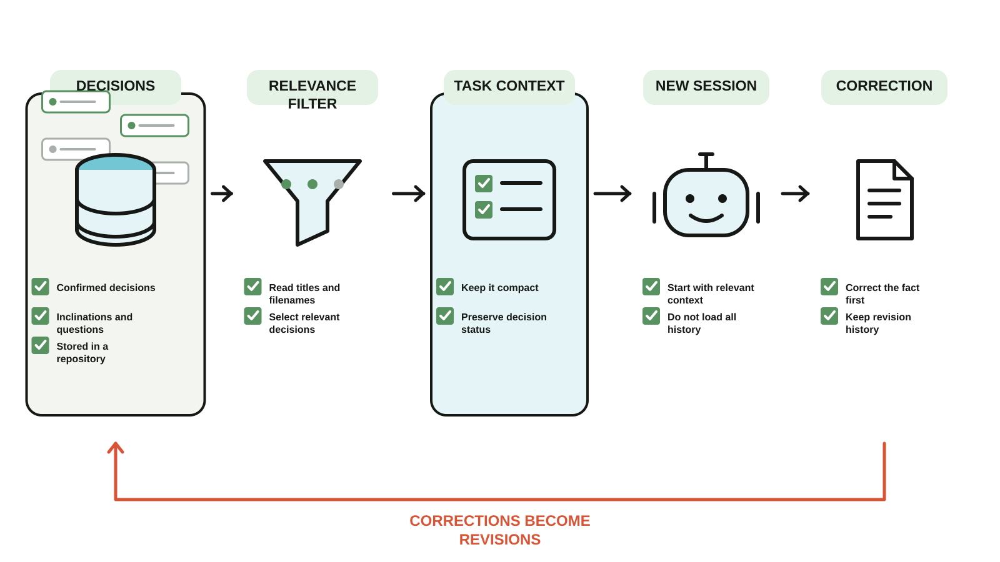
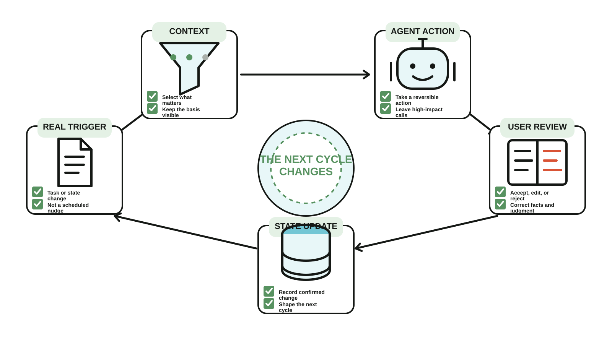

# Mechanism Illustration Skill

A Codex Skill and dependency-free SVG renderer for turning documented workflows into consistent bilingual mechanism illustrations.



*The Skill's own workflow, rendered deterministically from [`templates/mechanism-illustration.json`](templates/mechanism-illustration.json). The same art layer also produces a [Chinese version](examples/mechanism-illustration.zh.svg).*

## What it does

- extracts a small mechanism contract before drawing;
- separates the reusable art layer from Chinese and English text layers;
- renders deterministic `art.svg`, `zh.svg`, and `en.svg` files from JSON;
- includes distinct Pipeline, Filter, and Loop layout grammars instead of forcing every mechanism into one row of steps;
- keeps generated explainers separate from product evidence;
- supports ImageGen-based pictogram exploration when a custom art layer is needed.

## Quick start

```bash
npm test
npm run render:examples
node scripts/render.mjs templates/telegram-miniapp.json dist
```

The renderer uses only Node.js built-ins. Copy a template, replace the documented stages and labels, then render both languages.

Use `layout: "pipeline"` for ordered stages. Use `layout: "filter"` when many possible inputs must become a smaller relevant set. Use `layout: "loop"` when an output or user response changes the next cycle.

## Layout grammars

Pipeline keeps a strict order. Filter makes the reduction from many possible inputs to a small relevant set visible. Loop closes the last state back into the first trigger and makes the changed next cycle the center of the composition.





The original Telegram deployment example remains available in [English](examples/telegram-miniapp.en.svg) and [Chinese](examples/telegram-miniapp.zh.svg).

## Use as a Codex Skill

Install or link this directory as `mechanism-illustration` in your Codex skills folder, then invoke `$mechanism-illustration`. Repository owners can also vendor the directory and route matching tasks to `SKILL.md` from their `AGENTS.md`.

See [README.zh-CN.md](README.zh-CN.md) for Chinese documentation.
