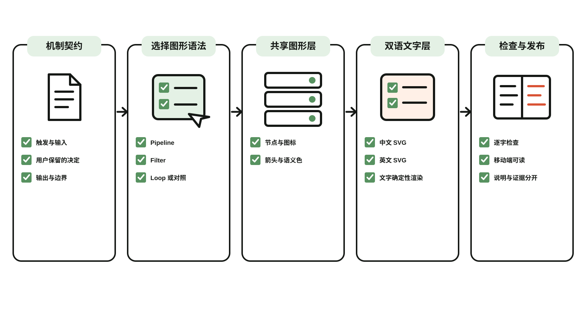
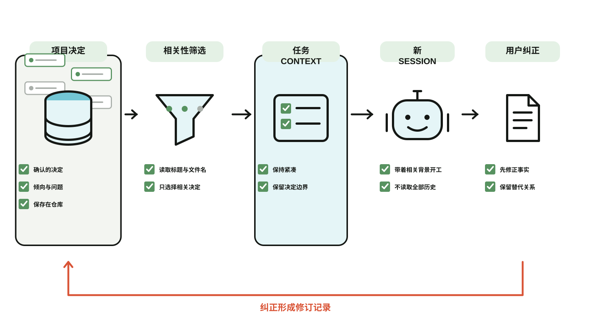
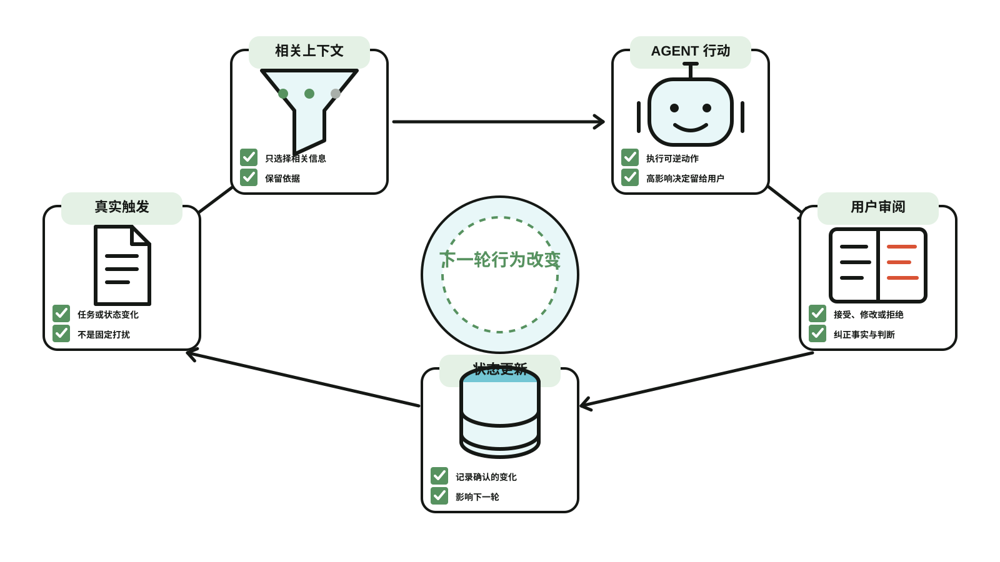

# 机制说明图 Skill

一个 Codex Skill 与零依赖 SVG 渲染器：把已经确认的产品机制、流程或系统转换为稳定的中英双语说明图。



*Skill 自身的工作方式，由 [`templates/mechanism-illustration.json`](templates/mechanism-illustration.json) 确定性渲染；同一图形层同时生成[英文版本](examples/mechanism-illustration.en.svg)。*

## 它解决什么

- 画图前先提取一份小型机制契约；
- 将可复用图形层与中英文文字层分开；
- 从 JSON 确定性生成 `art.svg`、`zh.svg` 与 `en.svg`；
- 提供不同的 Pipeline、Filter 与 Loop 空间结构，不再把所有机制都硬塞进一排步骤；
- 保持“说明图”和“真实产品证据”的边界；
- 需要新 pictogram 时，可以先用 ImageGen 探索，再把最终图形固化到模板。

## 快速开始

```bash
npm test
npm run render:examples
node scripts/render.mjs templates/telegram-miniapp.json dist
```

渲染器只依赖 Node.js 内置模块。复制一份模板，替换已经确认的流程与双语标签，即可同时生成中文和英文版本。

有严格先后顺序的机制使用 `layout: "pipeline"`；从很多输入中筛出少量相关内容时使用 `layout: "filter"`；输出或用户反馈会改变下一轮时使用 `layout: "loop"`。

## 图形语法

Pipeline 表达严格顺序；Filter 直接画出“很多可能输入如何减少成少量相关内容”；Loop 把最后状态接回最初触发，并把“下一轮发生了什么变化”放在画面中心。





原来的 Telegram 部署示例仍可查看[中文版](examples/telegram-miniapp.zh.svg)与[英文版](examples/telegram-miniapp.en.svg)。

## 作为 Codex Skill 使用

将这个目录安装或链接为 Codex skills 目录下的 `mechanism-illustration`，然后使用 `$mechanism-illustration` 显式调用。仓库也可以直接内置这个目录，并在 `AGENTS.md` 中把相关任务路由到 `SKILL.md`。
