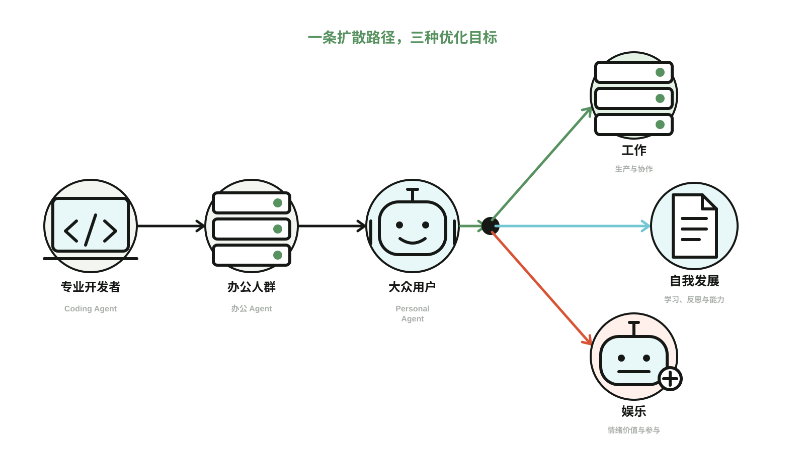
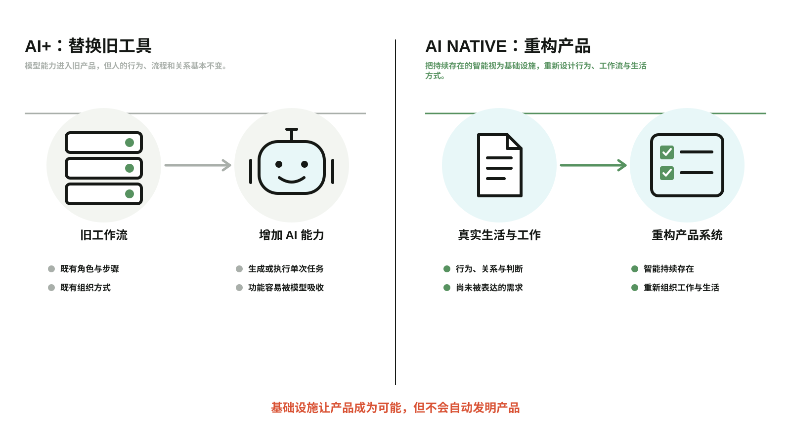
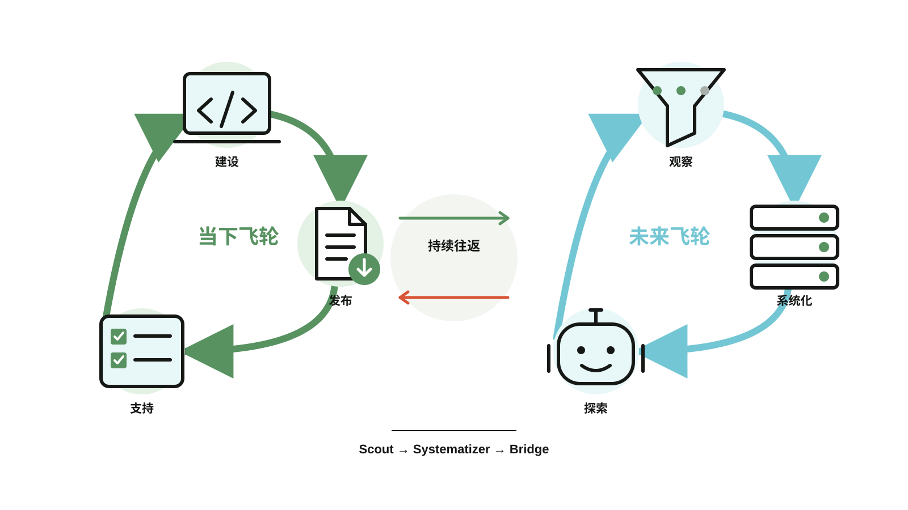

# 机制说明图 Skill

一个 Codex Skill 与零依赖 SVG 渲染器：把已经确认的产品机制、流程或系统转换为稳定的中英双语说明图。

## 它解决什么

- 画图前先提取一份小型机制契约；
- 将可复用图形层与中英文文字层分开；
- 从 JSON 确定性生成 `art.svg`、`zh.svg` 与 `en.svg`；
- 提供 Pipeline、Filter、Loop、Branch、Before/After 与 Dual Loop 空间结构，不再把所有机制都硬塞进一排步骤；
- 为文章与概念说明提供第二套 Editorial Field Map 视觉语言；
- 保持“说明图”和“真实产品证据”的边界；
- 需要新 pictogram 时，可以先用 ImageGen 探索，再把最终图形固化到模板。

## 快速开始

```bash
npm test
npm run render:examples
node scripts/render.mjs templates/telegram-miniapp.json dist
```

渲染器只依赖 Node.js 内置模块。复制一份模板，替换已经确认的流程与双语标签，即可同时生成中文和英文版本。

有严格先后顺序的机制使用 `pipeline`；从很多输入中筛出少量相关内容时使用 `filter`；反馈改变下一轮时使用 `loop`；同一条路径抵达真正的分化点时使用 `branch`；结构差异本身就是论点时使用 `before-after`；两个不同时间尺度的循环需要同时运转时使用 `dual-loop`。

## 布局目录

### Pipeline：有顺序的阶段

用于阶段存在明确先后关系，并最终到达一个终点的机制。


[模板 JSON](templates/mechanism-illustration.json) · [中文 SVG](examples/mechanism-illustration.zh.svg) · [英文 SVG](examples/mechanism-illustration.en.svg) · [图形层](examples/mechanism-illustration.art.svg)

### Filter：很多输入变成相关集合

用于“筛选”本身就是核心机制，而不是普通流程中的一个步骤。


[模板 JSON](templates/cairn-context.json) · [中文 SVG](examples/cairn-filter.zh.svg) · [英文 SVG](examples/cairn-filter.en.svg) · [图形层](examples/cairn-filter.art.svg)

### Loop：反馈改变下一轮

用于最后状态或用户反馈会改变下一轮行为的机制。


[模板 JSON](templates/agent-feedback-loop.json) · [中文 SVG](examples/agent-feedback-loop.zh.svg) · [英文 SVG](examples/agent-feedback-loop.en.svg) · [图形层](examples/agent-feedback-loop.art.svg)

### Branch：一条路径分化成不同目标

用于共同的采用路径或输入到达真正的分化点，并形成优化目标不同的多个结果。



[模板 JSON](templates/agent-divergence.json) · [中文 SVG](examples/agent-divergence.zh.svg) · [英文 SVG](examples/agent-divergence.en.svg) · [图形层](examples/agent-divergence.art.svg)

### Before/After：比较两套因果结构

用于“结构发生了什么变化”本身就是论点的场景。这个示例使用 Editorial Field Map 视觉语言。



[模板 JSON](templates/ai-applications-before-after.json) · [中文 SVG](examples/ai-applications-before-after.zh.svg) · [英文 SVG](examples/ai-applications-before-after.en.svg) · [图形层](examples/ai-applications-before-after.art.svg)

### Dual Loop：两个循环持续交换信息

用于两个飞轮运行在不同时间尺度上，并且都不能停止的机制。这个示例同样使用 Editorial Field Map。



[模板 JSON](templates/two-flywheels.json) · [中文 SVG](examples/two-flywheels.zh.svg) · [英文 SVG](examples/two-flywheels.en.svg) · [图形层](examples/two-flywheels.art.svg)

更偏操作说明的 Telegram 部署 Pipeline 仍可查看[中文版](examples/telegram-miniapp.zh.svg)与[英文版](examples/telegram-miniapp.en.svg)。

## 作为 Codex Skill 使用

将这个目录安装或链接为 Codex skills 目录下的 `mechanism-illustration`，然后使用 `$mechanism-illustration` 显式调用。仓库也可以直接内置这个目录，并在 `AGENTS.md` 中把相关任务路由到 `SKILL.md`。
